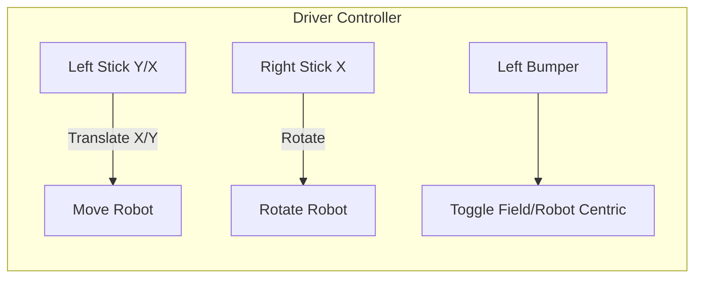

# 2026-Rebuilt-Robot

## Overview
This repository contains the codebase for the **2026-Rebuilt-Robot**, developed using the FIRST Robotics WPILib Python Command-based framework. It features a CTRE Phoenix 6 Swerve Drive infrastructure, dynamic LED status signaling, a multi-mechanism Intake and Shooter, and an advanced PhotonVision pose-estimation system for on-the-fly targeting.

## Key Subsystems & Features

- **Advanced Vision Integration (`VisionSubsystem.py`)**: Uses `photonlibpy` for precision AprilTag tracking. Calculates standard deviations dynamically based on target ambiguity and array size, passing reliable position coordinates back to the swerve odometry logic. 
- **Auto-Aim and Variable Shooting**: Uses drivetrain `ChassisSpeeds` combined with a velocity lookahead to compensate for lateral movement delay. This ensures the robot predicts its future location to seamlessly pre-align while strafing. Distance is computed dynamically and fed into an exponential curve for real-time flywheel speed mapping.
- **Alliance Agnostic Field Play**: Automatically detects Driver Station alliance details from the FMS and reflects target positions cleanly across Cartesian limits, meaning autonomous routines behave identically on Red or Blue alliances.
- **VelocityVoltage Flywheels**: The robot uses Phoenix 6 `VelocityVoltage` loops rather than simple DutyCycle percentages for precise Rotations Per Second targeting on shooter and intake wheels.

---

## Technical Configuration & Data Management

### `constants.py`
The central hub for tunable system constants. It houses drivetrain speed coefficients, joystick deadzones, default flywheel/indexer RPS values, and `TARGET_SHOOTER_DATA` arrays used for automatic coefficient mapping.

### `tools/distance_solver`
Use: `python tools/distance_solver/distance_solver.py`

A custom utility script used for finding the optimal polynomial curve fit algorithm for the shooter's capabilities. 
By editing the `TARGET_SHOOTER_DATA`—an array of `(distance, RPS)` tuples representing empirical flywheel speed vs distance testing—in `constants.py` and running this solver, the program will automatically recalculate new quadratic curve coefficients and inject them directly back into `constants.py` when the solver successfully validates the inputs against the new coefficients. 

This generated precision polynomial (`SHOOTER_QUADRCOEF_A` etc.) is used during Auto-Aim calculations (`RobotContainer._flywheel_speed_from_distance`) to continuously map shooting wheel iterations alongside vision depth mapping.

---

## Operating Controls

The robot uses a dual-controller layout to organize driving dynamics and operator mechanics efficiently.

### Visual Controller Mappings

```mermaid Partner Controller
flowchart LR
    subgraph Partner Controller
        subgraph Other
            PARTNER_START[Start Button] --> Dec[Decrease Variable Target RPS]
            PARTNER_BACK[Back Button] --> Inc[Increase Variable Target RPS]
            PARTNER_RIGHT_STICK[Right Stick Press] --> VisSeed[Seed Drivetrain Pose]
        end

        subgraph Bumpers and Triggers
            PARTNER_LEFTBUMPER[Left Bumper] -->|Hold| IdxIn[Run Indexer]
            PARTNER_LEFTTRIGGER[Left Trigger] -->|Hold| InStop[Intake Stop]
            
            PARTNER_RIGHTTRIGGER[Right Trigger] -->|Hold| Auto[Auto-Aim & Distance Spool]
            PARTNER_RIGHTBUMPER[Right Bumper] -->|Hold| IdxStop[Stop Indexer]
        end

        subgraph Face Buttons
            PARTNER_X_BUTTON[X/Square] --> InIn[Intake In]
            PARTNER_Y_BUTTON[Y/Triangle] --> InOut[Intake Out]
            PARTNER_A_BUTTON[A/Cross] --> StartFly[Start Flywheel Default]
            PARTNER_B_BUTTON[B/Circle] --> StopFly[Stop Flywheel]       
        end

        subgraph D-Pad
            PARTNER_DPAD_UP[D-Pad Up] --> SP_Fly_100[Preset 100RPS]
            PARTNER_DPAD_RIGHT[D-Pad Right] --> SP_Fly_80[Preset 80RPS]
            PARTNER_DPAD_DOWN[D-Pad Down] --> SP_Fly_60[Preset 60RPS]
            PARTNER_DPAD_LEFT[D-Pad Left] --> SP_Fly_40[Preset 40RPS]
        end

        subgraph SysId Options
            PARTNER_BackX[Back + X] --> SysDynR[SysId Dynamic Rev]
            PARTNER_BackY[Back + Y] --> SysDynF[SysId Dynamic Fwd]
            PARTNER_StartY[Start + Y] --> SysQuaF[SysId Quasi Fwd]
            PARTNER_StartX[Start + X] --> SysQuaR[SysId Quasi Rev]
        end
    end
```

*(Note: Simulator controls use a slightly modified mapping schema binding keyboard variables in `wpilib.RobotBase.isSimulation()` checks to accompdate testing with an XBox Wireless controller).*
